# cfizz

> **CFIZZ** stands for **C**hromosome **F**low **I**ntegration with **Z**one-**T**erminal **V**isuali**z**ation.
> 全称:**Chromosome Flow Integration with Zone-Terminal Visualization**(染色体流整合与区段末端可视化)。

cfizz 是一个端到端的 **Hi-C 染色质构象捕获数据分析与差异分析**Python 库,核心特色是位于整个分析流水线**末端**的 **Zone-Terminal 可视化模块**,用于把分析结果转化为**出版级(publication-ready)**的多组学可视化图表。

## 核心定位

- **端到端整合**(End-to-end Integration):从 **fastq 原始测序 reads** 一路走通,经过质控 / 比对 / pairs 解析 / matrix 聚合,得到 `.mcool` 中间产物 → A/B compartment / TAD / Loop 计算 → 多样本差异分析 → 出版级图表,一条流水线串通,无需手动拼装。
- **差异分析**(Differential Analysis):基于 **"临近匹配 + 阈值分类"** 的统一设计思路,覆盖三类特征
  - **核心思路**:对每个特征(Compartment / TAD / Loop)在两个样本间做"对应物"匹配,按匹配距离分类成"稳定 / 变化 / 独有"等类别
  - 匹配方式因信号特性而异,KDTree 实现高效匹配
- **Zone-Terminal 可视化**:cfizz 的标志性模块
  - **Zonal(分区式适配)**:作为分区叠加层,适配 A/B compartment、TAD、Loop 等不同基因组区段。
  - **Terminal(末端定位)**:位于整个分析流水线的末端,作为"最后一公里"辅助模块,把分析结果转化为可直接投稿的图。

## 环境依赖

### Python 版本

- Python ≥ 3.9

### 完整 Hi-C 流水线 + 依赖分类

cfizz 支持从 **fastq 原始测序数据** 一路到 **publication-ready 图表** 的全链路,依赖按"在流水线哪一段"分 3 类:

#### A. 测序预处理(fastq → mcool 全链路)

> 本节列出的 7 个 CLI 工具是 `src/cfizz/preprocessing/` 目录里的脚本包装的外部命令。cfizz **不重新实现**任何 fastp / bwa-mem2 / pairtools / cooler 的算法,仅做"参数化 + skip-if-exists 容错 + 显式日志"的薄包装(详见上方「完整数据流水线」一节)。**如已有 HiC-Pro / distiller 等成熟流程,可跳过本节。**

| 工具 | 版本 | 渠道 | 用途 |
|------|------|------|------|
| fastp | ≥ 1.0 | bioconda | fastq 质控 + adapter 修剪 |
| bwa-mem2 | ≥ 2.2 | bioconda | fastq → sam 比对(Hi-C 第一步) |
| samtools | ≥ 1.18 | bioconda | sam → bam 转换 + 排序 + 索引 |
| pairtools | ≥ 1.0 | bioconda | bam → pairs 转换(Hi-C 第二步)+ sort + dedup + select |
| pairix | ≥ 0.3 | bioconda | pairs 文件索引 |
| cooler | ≥ 0.3 | bioconda | pairs → cool → mcool + zoomify + balance |
| ucsc-fetchchromsizes | - | bioconda | 染色体大小文件下载 |

#### B. cfizz 本体核心(计算 + 绘图)

| 依赖 | 版本 | 用途 |
|------|------|------|
| numpy | ≥ 1.23 | 数值计算 |
| scipy | ≥ 1.10 | 科学计算 |
| pandas | ≥ 1.5 | 数据框 |
| matplotlib | ≥ 3.5 | 绘图基础 |
| seaborn | ≥ 0.11 | 统计绘图 |
| cooltools | ≥ 0.5 | compartment / insulation 算法 |
| bioframe | ≥ 0.6 | 基因组区域操作 |
| cytoolz | ≥ 0.12 | 函数式工具 |
| h5py | ≥ 3.0 | HDF5 读写(cooler 底层) |
| pyarrow | ≥ 10.0 | 高效列存(cooler 大文件底层) |
| numba | ≥ 0.56 | JIT 加速(cooltools 内部) |
| cython | ≥ 3.0 | cooler 编译 |
| tqdm | ≥ 4.60 | 进度条 |

#### C. 扩展功能(7_x 多组学可视化必需)

| 依赖 | 用途 |
|------|------|
| pyBigWig ≥ 0.3 | BigWig 文件读(region 子集提取等,7_x 与 4_1 demo 必需) |
| pyfaidx ≥ 0.7 | FASTA 索引(若用户备 fasta) |
| statsmodels | 统计检验(scipy 之外补充) |
| patsy | statsmodels 依赖 |
| scikit-image | 图像处理辅助 |
| scikit-learn | 机器学习辅助 |
| htslib ≥ 1.18 | samtools 底层(samtools 自动装) |
| pysam ≥ 0.22 | samtools 的 Python 绑定 |

#### D. Loop 检测 CLI + 绘图辅助(conda 装不到,走 pip)

| 包 | 用途 |
|----|------|
| hicpeaks ≥ 0.3.0 | 提供 `pyHICCUPS` CLI(5_1 跑 Loop calling 步骤必需) |
| adjustText ≥ 1.0 | matplotlib 文本自动避让(防止 viz 图上 label 重叠) |

> **说明**:上表 A 类的 7 个 CLI 工具(fastp / bwa-mem2 / samtools / pairtools / pairix / cooler / ucsc-fetchchromsizes)虽然列在「环境依赖」中,但仅当你**从 fastq 起始**用 `src/cfizz/preprocessing/` 目录里的参考脚本时才必需;已有 `.mcool` 文件的可以完全跳过。详见上方「完整数据流水线」一节。

### 安装方式(三步走)

cfizz 依赖分两层,推荐用 **micromamba + pip** 组合安装(也支持 mamba / conda):

#### 第 1 步:用 micromamba 一键建环境

```bash
# 克隆仓库
git clone https://github.com/Cuixiaojian21/cfizz.git
cd cfizz

# 用 environment.yml 一键创建 conda 环境(从 conda-forge + bioconda 装)
micromamba env create -f environment.yml
micromamba activate cfizz
```

#### 第 2 步:用 pip 装 pip-only 补充(Loop 检测 CLI + 绘图辅助)

```bash
# 推荐:用 requirements.txt 一键装(包含 hicpeaks + adjustText)
pip install -r requirements.txt

# 或单独装
# pip install hicpeaks     # 提供 pyHICCUPS CLI(5_1 跑 Loop calling 步骤必需)
# pip install adjustText   # matplotlib 文本自动避让
```

#### 第 3 步:以可编辑模式装 cfizz 本体

```bash
pip install -e .
```

至此,7 个 example 全部可跑(README 只展示前 6 个;7_2/7_3 仍保留在 `examples/integrated/` 目录供本地自跑)。

#### 验证安装成功

```bash
# 1. 验证 cfizz 本体(在任何目录都能跑,editable 装好之后)
python -c "import cfizz; print(f'cfizz v{cfizz.__version__} OK')"
# 期望输出: cfizz v0.1.0 OK

# 2. 验证核心 4 件套(数值 + Hi-C + BigWig + 绘图辅助)
python -c "import cooler, cooltools, pyBigWig, adjustText; print('core deps OK')"
# 期望输出: core deps OK

# 3. 验证 pyHICCUPS CLI(Loop 检测必需)
which pyHICCUPS && pyHICCUPS --version
# 期望输出: /home/.../bin/pyHICCUPS
#           pyHICCUPS 0.3.x
```

## 完整数据流水线

> **cfizz 的强项是流水线末端**(A/B compartment / TAD / Loop 计算 + 差异分析 + 多组学可视化)。**测序预处理**(`fastq → .mcool`)cfizz 提供**参考脚本**(`src/cfizz/preprocessing/` 目录里的 3 个 .sh + .py),但**不是强制** —— 如果你已有 HiC-Pro 等其他预处理流程,完全可以跳过这一步,直接把 `.mcool` 喂给 cfizz 的下游分析。

### 数据流水线总览(fastq → publication-ready)

```mermaid
flowchart LR
    subgraph UP["上游预处理(可选,src/cfizz/preprocessing/ 提供)"]
        A1["FASTQ<br/>R1.fq.gz<br/>R2.fq.gz"]
        A2["QC<br/>fastp"]
        A3["Mapping<br/>bwa-mem2 + samtools view"]
        A4["pairs<br/>pairtools parse + sort + dedup + select"]
        A5[".mcool<br/>cooler cload + zoomify + balance"]
        A1 --> A2 --> A3 --> A4 --> A5
    end

    subgraph MID["cfizz 本体(核心:Compartment / TAD / Loop + 差异)"]
        B1["5_x 常规分析<br/>Compartment / TAD / Loop<br/>+ Heatmap / Saddle / Pileup"]
        B2["6_x 差异分析<br/>临近匹配 + 阈值分类<br/>+ 差异可视化 + 差异累计"]
        A5 --> B1 --> B2
    end

    subgraph DOWN["cfizz 本体(末端:Zone-Terminal 多组学可视化)"]
        C1["7_x 多组学整合<br/>Hi-C + BigWig + GTF + BED<br/>= publication-ready 图"]
        B2 --> C1
    end

    style A1 fill:#fde0c5,stroke:#e76f51
    style A5 fill:#c5e3f6,stroke:#2a9d8f
    style B1 fill:#cdebba,stroke:#264653
    style B2 fill:#cdebba,stroke:#264653
    style C1 fill:#f4e3c4,stroke:#e76f51,stroke-width:3px
```



### 上游预处理(参考实现,非强制)

> **重要说明**:本节列出的 4 个 CLI 工具中,**pairtools 和 cooler 是 [open2C](https://github.com/open2c) 社区开发维护的 Hi-C 标准工具链**(专用于染色质构象捕获数据处理);**fastp / bwa-mem2 / samtools 是通用生信 CLI**。`src/cfizz/preprocessing/` 目录里的 3 个脚本**只做参数化包装 + skip-if-exists 容错 + 显式日志**。

`src/cfizz/preprocessing/` 目录提供 3 个**参数化**的脚本:

| 脚本 | 形态 | 包装的 CLI 工具(open2C / 其他) | 输入 | 输出 |
|------|------|--------------------------------|------|------|
| `src/cfizz/preprocessing/fastq2pairs.sh` | bash | fastp + bwa-mem2 + samtools view(其他)<br/>pairtools parse / sort / dedup / select(open2C) | `.fastq.gz` (R1+R2) | `.nodups.UU.pairs.gz` |
| `src/cfizz/preprocessing/pairs2mcool.sh` | bash | cooler cload / zoomify / balance(open2C) | `.nodups.UU.pairs.gz` | 多分辨率平衡的 `.mcool` |
| `src/cfizz/preprocessing/stats.py` | python | (只读 pairtools `*.stats` 文件,纯 Python 解析) | pairtools 的 `*.stats` | 每样本处理得率表(.txt + .tsv) |

**典型调用**:

```bash
# Step 1: fastq → filtered pairs(参数化版)
bash src/cfizz/preprocessing/fastq2pairs.sh \
    --samples sampleA sampleB \
    --data-dir /data/fastq \
    --output-root /out \
    --bwa-index /ref/hg38.fa \
    --chrom-sizes /ref/hg38.sizes \
    --assembly hg38 --tech-type hic --nproc 8

# Step 2: filtered pairs → balanced multi-resolution mcool
bash src/cfizz/preprocessing/pairs2mcool.sh \
    --samples sampleA sampleB \
    --output-root /out \
    --chrom-sizes /ref/hg38.sizes \
    --base-resolution 1000 \
    --resolutions "5000,10000,25000,50000,100000,250000,500000,1000000"

# Step 3: 统计各步骤得率(可选,QC 用)
python3 src/cfizz/preprocessing/stats.py \
    --pairtools-root /out \
    --samples sampleA sampleB \
    --display-names "WT" "KO" \
    --output /out/processing_stats.txt
```

### fasta 文件 + 染色体大小文件(完整流程必需)

**完整 Hi-C 数据处理流程**(从 fastq 原始测序 reads 到 mcool):

```
fastq  →  fastp 质控  →  bwa-mem2 比对  →  samtools 转 bam
       →  pairtools parse  →  pairtools dedup  →  pairtools select
       →  cooler cload  →  cooler zoomify  →  cooler balance  →  mcool
       →  cfizz 5_x / 6_x / 7_x(本仓库入口)
```

#### 完整流程需要的"参考文件"

| 文件 | 用途 | 仓库自带? | 来源 |
|------|------|----------|------|
| **fasta**(.fa) | bwa-mem2 索引 + cfizz 算 GC cov | ❌ 不带(3GB) | 用户自备(如 `hg38.fa`) |
| **chrom.sizes**(染色体大小) | pairtools parse / cooler cload 的 bins 规格 | ❌ 不带 | 用户自备,或 `ucsc-fetchchromsizes hg38` 下载 |
| **bwa 索引**(.amb/.ann/.bwt/.pac/.sa) | bwa-mem2 比对必需 | ❌ 不带 | `bwa-mem2 index hg38.fa` 生成 |

#### 5_1 example 额外需要 fasta

`5_1` 走 `cfizz.analyze.compartment.process_compartment` 算 Compartment,内部需要 fasta 计算 GC 含量。路径在 `examples/5_1_primary_analysis_template.py` 顶部 `FASTA_PATH` 变量设置:

```python
FASTA_PATH = "/path/to/your/hg38.fa"  # ⚠️ 改成你自己的 fasta 路径
```

## 示例脚本(`cfizz/examples/`)

仓库自带 **7 个端到端 example**(README 展示前 6 个;7_2/7_3 在 examples/ 目录供本地自跑),覆盖 3 大可视化阶段(常规分析 / 差异分析 / 多组学可视化)。所有 example 都已经过 demo 数据集(`cfizz/demo/data/`)验证可跑通,产物落在 `cfizz/demo/output/`。

### 1. 常规分析(Primary Analysis)

#### `5_1_primary_analysis_template.py` — 常规分析模板

**功能**:从 `.mcool` 中间产物出发,调用 cooltools、HiCPeaks(pyHiCCUPs)等最常用的公开工具,计算 3 类特征 — Compartment / TAD / Loop。

**输入**:`cfizz/demo/data/hiPSC_nor_chr17.mcool` + `hiPSC_var_chr17.mcool`(chr17 demo mcool,各 10kb + 100kb 双分辨率)

**产物结构**(`cfizz/demo/output/5_1_primary_analysis_template/`):
```
1_computation/                  # 原始计算产物(tsv)
  compartment/{hiPSC_nor, hiPSC_var}/
    eigenvector.100k.tsv         # 特征向量(Compartment)
    gc_cov.100k.tsv              # GC 含量
  tad/{hiPSC_nor, hiPSC_var}/
    *.10000.insulation.tsv       # 绝缘分数
    *.{50kb,100kb,500kb}.boundaries.tsv  # 边界
    *.{50kb,100kb,500kb}.tads.tsv        # TAD 区域
  loop/{hiPSC_nor, hiPSC_var}/
    *.10k.loops.txt              # Loop 列表(BEDPE 6 列)
2_visualization/                # 可视化产物
  heatmap/  compartment/  tad/  loop/
3_pileup/                       # 累计分析
  apa/  saddle/  tad_pileup/
4_differential/                 # 差异分析(由 6_x 写入)
  hiPSC_var--hiPSC_nor/
    compartment/  loops/  tad_boundary/  viz/
```

**跑法**:
```bash
cd /path/to/cfizz
python examples/5_1_primary_analysis_template.py
```

#### `5_2_primary_analysis_visualization.py` — 常规分析可视化

**功能**:基于 5_1 产物,做 4 类可视化 — Heatmap / Compartment / TAD / Loop。

**输入**:`cfizz/demo/data/`(同 5_1)+ `cfizz/demo/output/5_1_primary_analysis_template/1_computation/`(5_1 产物)

**产物**:`cfizz/demo/output/5_1_primary_analysis_template/2_visualization/`(4 类子目录,每类含 hiPSC_nor / hiPSC_var / multi 三套)

**区域**:chr17:10M-12M(2Mb @ 10kb)

**可视化接口**(下面 6 个示例分别用 6 个不同的 cfizz 函数 / quick API):

#### 1. Heatmap 多 sample 对比(基础多 sample)

调用 `generate_multi_heatmap`,面向成对样本的互作矩阵可视化,绘制热图。cfizz 保留了大量公开参数,用户可根据需要自由调整基因组位置、分辨率、配色、输出格式等:

```python
generate_multi_heatmap(
    file_paths=list(samples.values()),     # 多 sample mcool 路径列表
    sample_names=list(samples.keys()),     # 样本名列表(对应图例)
    chrom=chrom,                            # 染色体(chr17 / chr1 / chrX 等)
    resolution=resolution,                  # 分辨率(bp,10000 = 10kb)
    start_pos=start_pos,                    # 起始位置(bp)
    end_pos=end_pos,                        # 终止位置(bp)
    output_dir=multi_viz_dir,               # 输出目录
    balance=False,                          # 是否 ICE 平衡(False=原始 / True=ICE)
    cmap='Reds',                            # 配色方案
    plot_size=4,                            # 单图寸尺
    formats=('png', 'svg'),                 # 输出格式(png / svg / jpg)
)
```

常用可调参数:

| 参数 | 含义 | 典型值 |
|------|------|-------|
| `chrom` | 染色体编号 | `'chr17'`、`'chr1'`、`'chrX'` |
| `resolution` | 分辨率(bp)| `10000`(10kb)、`100000`(100kb) |
| `start_pos` / `end_pos` | 区域起止(bp)| `10_000_000` ~ `12_000_000`(2Mb) |
| `balance` | ICE 平衡 | `False`(原始)/ `True`(ICE 标准化) |
| `cmap` | 配色 | `'Reds'`、`'Blues'`、`'coolwarm'`、`'RdBu_r'` |
| `plot_size` | 单图寸尺(cm) | `4`(默认)　|
| `formats` | 输出格式 | `('png',)`、`('png', 'svg')`、`('png', 'jpg')` |

<p align="center">
  <b>1. Heatmap(多 sample 对比,generate_multi_heatmap)</b><br>
  
</p>

#### 2. A/B Compartment 多 sample 对比(多 sample eigenvector 对齐)

调用 `generate_multi_compartment`,多 sample 输入是上游 eigenvector TSV + O/E 矩阵 npy 路径列表:

```python
generate_multi_compartment(
    eig_tsv_paths=multi_eig_paths,  # 5_1 算的 eigenvector TSV 路径列表(逐 sample)
    oe_npy_paths=multi_oe_paths,    # O/E 矩阵 .npy 路径列表(load_or_compute_oe_matrix 提供OE矩阵计算或读取的接口)
    output_dir=multi_viz_dir,       # 输出目录
    sample_names=multi_sample_names,# 样本名列表(对应图例)
    chrom=chrom,                    # 染色体
    resolution=resolution,          # 分辨率(bp,默认 100000)
    start_pos=start_pos,            # 起始位置(bp)
    end_pos=end_pos,                # 终止位置(bp)
    plot_size=4                     # 单图寸尺(cmap panel 宽)
)
```

常用可调参数:

| 参数 | 含义 | 典型值 |
|------|------|-------|
| `eig_tsv_paths` / `oe_npy_paths` | 5_1 算好的输入路径列表 | 由 `load_or_compute_oe_matrix` 缓存产生 |
| `start_pos` / `end_pos` | 区域起止(bp)| `0` ~ `83_000_000` |
| `resolution` | 分辨率(bp)| `100000`(100kb,惯用) |
| `sample_names` | 对应图例 | `["hiPSC_var", "hiPSC_nor"]` |
| `plot_size` | 单图寸尺 | `4`(默认)|

<p align="center">
  <b>2. A/B Compartment(多 sample 对比,chr17 全长 0-83M,generate_multi_compartment)</b><br>
  
</p>

#### 3. TAD 边界 多 sample 对比(半三角 + 各自 insulation)

调用 `quick_plot_integrated` 高级 quick API,输入是半三角 + 各自 insulation_path:

```python
quick_plot_integrated(
    hics=[
        {
            'file': mcool_path,                   # mcool 路径
            'name': sample_name,                  # 样本名(对应图例)
            'cmap': 'Reds',                       # 配色统一
            'balance': False,                     # 是否 ICE 平衡
            'triangle_ratio': 0.5,                # 半三角(0.5)/ 全三角(1)
            'flip_vertical': flip,                # 第 2 个 sample 翻转对齐
            'insulation_path': insulation_path,   # 5_1 算的边界 TSV(各自用各自的)
            'window_size': window_size,            # 边界检测窗口 bp(100000)
            'boundary_cmap': 'Blues_r',           # 边界点配色
            'boundary_alpha': 0.9,                # 边界点透明度
        }
        for i, (sample_name, mcool_path, insulation_path) in enumerate(valid_pairs)
    ],
    tracks=[],                                                    # 无 tracks
    region=GenomeRange(chrom=chrom, start=start_pos, end=end_pos),
    output=f"{multi_viz_dir}/tad_multi",                          # 输出前缀
    width_cm=8,                                                   # 总宽
    gap_cm=0.2,                                                   # hics 间距
    left_margin_cm=1.0,                                           # 左边距
    right_margin_cm=2.0,                                          # 右边距
    dpi=300                                                       # 分辨率
)
```

常用可调参数:

| 参数 | 含义 | 典型值 |
|------|------|-------|
| `triangle_ratio` | 三角/全矩阵 | `0.5`(半三角)/ `1.0`(全)/ `0`(全矩阵) |
| `flip_vertical` | 上下翻转对齐 | `False`(第 1 个 sample)/ `True`(第 2 个 sample,用于跨样本对齐) |
| `insulation_path` | 边界 TSV | `5_1` 产物路径,逐 sample 指定 |
| `window_size` | 边界检测窗口 bp | `100000`(默认)/ `50000`(密集)/ `200000`(稀疏) |
| `boundary_cmap` / `boundary_alpha` | 边界点样式 | `'Blues_r'` + `0.9`(默认) |
| `width_cm` / `gap_cm` / 边距 | 版式 | `8` / `0.2` / `1.0` / `2.0` 默认值 |

<p align="center">
  <b>3. TAD 边界(多 sample 对比,quick_plot_integrated + 各自 insulation_path)</b><br>
  
</p>

#### 4. Loop 标注 多 sample 对比(全三角 + 各自 loops.txt)

调用 `plot_multi_heatmap_with_loops`,逐 sample 读 mcool + 各自 loops.txt:

```python
plot_multi_heatmap_with_loops(
    mcool_paths=[p[1] for p in valid_pairs],     # 多 sample mcool 路径列表
    loops_paths=[p[2] for p in valid_pairs],     # 5_1 算的 loops.txt 路径列表(各自用各自的)
    output_path=f"{multi_viz_dir}/loops_multi",  # 输出前缀
    sample_names=[p[0] for p in valid_pairs],    # 样本名列表(对应图例)
    chrom=chrom,                                  # 染色体
    start=start_pos,                              # 起始位置(bp)
    end=end_pos,                                  # 终止位置(bp)
    resolution=resolution,                        # 分辨率(bp)
    loop_color='blue',                            # loop 锚点颜色
    loop_alpha=0.6,                               # loop 锚点透明度
    loop_size=2,                                  # loop 锚点大小
    balance=False,                                # 是否 ICE 平衡
    plot_size=4,                                  # 单图寸尺
)
```

常用可调参数:

| 参数 | 含义 | 典型值 |
|------|------|-------|
| `loops_paths` | loops.txt 路径列表 | 由 `5_1` HiCCUPS 产物,逐 sample 指定 |
| `start` / `end` | 区域起止(bp)| `10_000_000` ~ `12_000_000`(2Mb) |
| `resolution` | 分辨率(bp)| `10000`(10kb,对应 loops.txt @ 10k) |
| `loop_color` / `loop_alpha` / `loop_size` | 锚点样式 | `'blue'` / `0.6` / `2`(默认) |
| `balance` | ICE 平衡 | `False`(原始)/ `True`(ICE) |
| `plot_size` | 单图寸尺 | `4`(默认)/ `3`(折中) |

<p align="center">
  <b>4. Loop 标注(多 sample 对比,plot_multi_heatmap_with_loops)</b><br>
  
</p>

#### 5. Heatmap 快速整图版(`quick_plot_integrated`,n_tracks=0)

调用 `quick_plot_integrated` + `n_tracks=0`,跨 sample 对齐用 `flip_vertical`:

```python
quick_plot_integrated(
    hics=[
        {
            'file': mcool_path,                   # mcool 路径
            'name': sample_name,                  # 样本名(对应图例)
            'cmap': 'Reds',                       # 配色
            'color_scale': 'linear',              # 颜色刻度(linear / log)
            'balance': False,                     # 是否 ICE 平衡
            'resolution': resolution,             # 分辨率(bp)
            'flip_vertical': flip,                # 第 2 个 sample 翻转对齐(跨样本对比)
            'triangle_ratio': 1,                  # 全三角(用于快速整合图)
        }
        for i, (sample_name, mcool_path) in enumerate(samples.items())
    ],
    region=GenomeRange(chrom=chrom, start=start_pos, end=end_pos),
    output=f"{qp_viz_dir}/heatmap_quick_plot",    # 输出前缀
    n_tracks=0,                                    # 不画任何 tracks(纯热图)
    dpi=300,                                       # 分辨率
    width_cm=8.0                                   # 总宽
)
```

常用可调参数:

| 参数 | 含义 | 典型值 |
|------|------|-------|
| `flip_vertical` | 上下翻转对齐 | 跨样本对比必备,逐 sample 标记 |
| `triangle_ratio` | 全三角 vs 全矩阵 | `1`(全三角)/ `0`(全矩阵) |
| `color_scale` | 颜色刻度 | `'linear'`(默认)/ `'log'` |
| `n_tracks` | 画几个 tracks | `0`(纯热图)/ `≥1`(下加 bigwig 等) |
| `width_cm` / `dpi` | 版式 | `8.0` / `300` 默认 |

<p align="center">
  <b>5. Heatmap 快速整图(quick_plot_integrated, n_tracks=0)</b><br>
  
</p>

#### 6. Heatmap + Loop 快速整图版(`quick_plot_integrated` + `loops_path`)

调用 `quick_plot_integrated` + 各自 `loops_path`,`n_tracks=0`:

```python
quick_plot_integrated(
    hics=[
        {
            'file': mcool_path,                   # mcool 路径
            'name': sample_name,                  # 样本名(对应图例)
            'cmap': 'Reds',                       # 配色
            'color_scale': 'linear',              # 颜色刻度
            'balance': False,                     # 是否 ICE 平衡
            'resolution': resolution,             # 分辨率(bp)
            'flip_vertical': flip,                # 第 2 个 sample 翻转对齐
            'loops_path': loops_path,             # 5_1 算的 loops.txt(逐 sample 各自用)
            'loop_color': 'blue',                 # 锚点颜色
            'loop_alpha': 0.8,                    # 锚点透明度(quick plot 默认比多 sample 版粗)
            'loop_size': 15,                      # 锚点大小(quick plot 默认比多 sample 版大)
        }
        for i, (sample_name, mcool_path, loops_path) in enumerate(valid_pairs)
    ],
    region=GenomeRange(chrom=chrom, start=start_pos, end=end_pos),
    output=f"{qp_viz_dir}/quick_plot_integrated",
    n_tracks=0,                                    # 不画任何 tracks
    dpi=3000,                                      # quick plot loop 默认高 DPI(3000)
    width_cm=8.0
)
```

常用可调参数:

| 参数 | 含义 | 典型值 |
|------|------|-------|
| `loop_color` / `loop_alpha` / `loop_size` | 锚点样式 | `'blue'` / `0.8` / `15`(quick plot 默认比多 sample 版本粗/大) |
| `flip_vertical` | 上下翻转对齐 | 跨样本对比必备 |
| `dpi` | 分辨率 | `300`(常规)/ `3000`(出版级,quick plot loop 默认) |
| `n_tracks` | 画几个 tracks | `0`(纯热图+loop)/ `≥1`(下加 bigwig 等) |

<p align="center">
  <b>6. Heatmap + Loop 快速整图(quick_plot_integrated + 各自 loops_path)</b><br>
  
</p>

**跑法**:
```bash
python examples/5_2_primary_analysis_visualization.py
```

#### `5_3_primary_analysis_pileup.py` — 常规分析累计分析

**功能**:基于 5_1 产物,做 3 类累计分析 — Saddle(Compartment 交互)/ TAD pileup / APA(Loop 中心堆叠)。

**输入**:`cfizz/demo/output/5_1_primary_analysis_template/1_computation/`(5_1 产物)

**产物**:`cfizz/demo/output/5_1_primary_analysis_template/3_pileup/`,3 类子目录各含 hiPSC_nor / hiPSC_var / multi 三套 PNG+SVG。

**关键决策**(本脚本不重算 5_1 已有的特征,只读路径画累计图):
- **Saddle**: 读 5_1 已算的全基因组 `eigenvector.tsv`,**额外依赖 fasta**(saddle 需要 GC 含量归一化)
- **TAD pileup**: 读 5_1 已算的 `boundaries.tsv`(**不**通过 insulation 自己提取)
- **APA**: 读 5_1 已算的 `loops.txt`(**不**用 HiCCUPS 重算)

**可视化接口**(下面 3 个示例分别用 3 个不同的 cfizz 函数):

#### 1. Saddle 多 sample 对比(A/B Compartment 交互矩阵)

调用 `generate_multi_saddle`,输入是 5_1 算好的 eigenvector + mcool(含 gc 校正,fasta 是前置依赖):

```python
generate_multi_saddle(
    cool_files=cool_files,                         # 多 sample mcool 路径列表(带 ::resolutions/100000 后缀)
    eigenvector_files=eigenvector_files,           # 5_1 算的 eigenvector.tsv 路径列表(逐 sample)
    output_dir=multi_outdir,                       # 输出目录
    sample_names=list(samples.keys()),             # 样本名列表(对应图例)
    cache_dir=f"{multi_outdir}/cache",             # GC 校正缓存目录
    n_bins=98,                                     # eigenvector 分箱数
    contact_type='cis',                            # 接触类型(cis = 同染色体)
    heatmap_size=4.0,                              # 单图寸尺(用户要求所有累计分析图统一 4cm)
    vmin=-1,                                       # 颜色范围下界(eigenvector ∈ [-1,1])
    vmax=1,                                        # 颜色范围上界
    n_cols=len(samples),                           # 子图列数(每 sample 一列)
    n_rows=1,                                      # 子图行数
    max_workers=2,                                 # 并发数(fasta GC 校正 IO 密集)
    nproc=8,                                       # 数据计算 CPU 核数
)
```

常用可调参数:

| 参数 | 含义 | 典型值 |
|------|------|-------|
| `n_bins` | eigenvector 分箱数 | `98`(默认)/ `50`(粗)/ `200`(细) |
| `contact_type` | 接触类型 | `'cis'`(同染色体,默认)/ `'trans'` |
| `vmin` / `vmax` | 颜色范围 | `-1` ~ `1`(eigenvector 全量程) |
| `heat_map_size` | 单图寸尺 | `4.0`(统一)/ `6.0`(放大单图) |
| `n_cols` / `n_rows` | 子图排布 | `len(samples)` × `1`(横排) |
| `nproc` / `max_workers` | 并发 | `8` / `2`(参考) |

<p align="center">
  <b>1. Saddle plot(A/B Compartment 交互矩阵,generate_multi_saddle)</b><br>
  
</p>

#### 2. TAD pileup 多 sample 对比(TAD 边界附近信号堆叠)

调用 `plot_multi_tad_boundary_pileup`,输入是 5_1 已算的 `boundaries.tsv` + mcool 路径列表:

```python
plot_multi_tad_boundary_pileup(
    mcool_paths=valid_mcool,                       # 多 sample mcool 路径列表
    boundaries_list=valid_boundaries,              # 5_1 算的 boundaries.tsv 列表(逐 sample,pd.read_csv 读好)
    output_path=f"{multi_outdir}/tad_pileup_multi",# 输出前缀
    sample_names=valid_names,                      # 样本名列表
    flank=300_000,                                 # 堆叠两侧延伸 bp
    resolution=10000,                              # 分辨率(bp,跟 boundaries.tsv 同 res)
    dpi=300,                                       # 分辨率
    balance=True,                                  # 是否 ICE 平衡
    method='mean',                                 # 聚合方法(mean / median / max)
    color_scale='linear',                          # 颜色刻度(linear / log)
    top_n=1000,                                    # 取 top N 边界(top_n 用于控制堆叠规模)
    cbar_label='mean normalized contacts',         # 色条标签
    plot_size=4.0,                                 # 单图寸尺(统一 4cm)
)
```

常用可调参数:

| 参数 | 含义 | 典型值 |
|------|------|-------|
| `flank` | 堆叠两侧延伸 bp | `300000`(300kb,默认)/ `500000`(宽) |
| `method` | 聚合方法 | `'mean'`(默认)/ `'median'` / `'max'` |
| `color_scale` | 颜色刻度 | `'linear'`(默认)/ `'log'` |
| `top_n` | 取 top N 边界 | `1000`(大量)/ `200`(精选)/ `None`(全堆) |
| `balance` | ICE 平衡 | `True`(默认,平衡后堆叠)/ `False`(原始) |
| `plot_size` | 单图寸尺 | `4.0`(统一) |

<p align="center">
  <b>2. TAD pileup(边界附近信号堆叠,plot_multi_tad_boundary_pileup)</b><br>
  
</p>

#### 3. Loop APA 多 sample 对比(Loop 中心信号堆叠)

调用 `plot_multi_apa_heatmap`,输入是 5_1 已算的 `loops.txt` + mcool 路径列表:

```python
plot_multi_apa_heatmap(
    mcool_paths=valid_mcool,                       # 多 sample mcool 路径列表
    loops_paths=valid_loops,                       # 5_1 算的 loops.txt 路径列表(逐 sample)
    output_path=f"{multi_outdir}/apa_multi",       # 输出前缀
    sample_names=valid_names,                      # 样本名列表
    resolution=10000,                              # 分辨率(bp,10kb)
    window=7,                                      # APA 中心 ±window bin(覆盖范围)
    corner_size=5,                                 # corner anchor 区域 bin 数(背景估算)
    min_distance=20,                               # 最小中心距离 bin(避免过近 loop 重复堆叠)
    vmin=None,                                     # 颜色下界(None = 自动)
    vmax=None,                                     # 颜色上界(None = 自动)
    balance=True,                                  # 是否 ICE 平衡
    n_processes=None,                              # 并发(None = 默认 = 1)
    plot_size=4.0,                                 # 单图寸尺(统一 4cm)
)
```

常用可调参数:

| 参数 | 含义 | 典型值 |
|------|------|-------|
| `window` | APA 中心 ±window bin | `7`(默认)/ `10`(宽)/ `5`(窄) |
| `corner_size` | corner anchor bin | `5`(默认)/ `3`(小)/ `10`(大) |
| `min_distance` | 最小中心距离 bin | `20`(默认,避免重复)/ `40`(更稀) |
| `vmin` / `vmax` | 颜色范围 | `None` / `None`(自动)/ `0` ~ `0.01`(固定) |
| `balance` | ICE 平衡 | `True`(默认)/ `False` |
| `plot_size` | 单图寸尺 | `4.0`(统一) |

<p align="center">
  <b>3. Loop APA(中心信号堆叠,plot_multi_apa_heatmap)</b><br>
  
</p>

**跑法**:
```bash
python examples/5_3_primary_analysis_pileup.py
```

### 2. 差异分析(Differential Analysis)

> **注意**:6_x 系列依赖 5_1 产物作为输入,**先跑 5_1 再跑 6_x**。

#### `diff/6_1_differential_compute.py` — 差异计算

**功能**:基于 5_1 产物,做三类差异分析 — Compartment 差异(Stable_A / Stable_B / A_to_B / B_to_A)/ TAD 边界变化(Unique_boundary / Boundary_shift / Stable_boundary)/ Loop 差异(gain / lost / common,HiCCUPS q-value 乘积)。

**输入**:`cfizz/demo/output/5_1_primary_analysis_template/1_computation/`(5_1 产物)

**产物**:`cfizz/demo/output/5_1_primary_analysis_template/4_differential/hiPSC_var--hiPSC_nor/`:
```
compartment/
  diff.tsv                 # Compartment 差异区段
  scatter.png/.svg         # 散点图
loops/
  diff.tsv                 # Loop 差异
  stacked_bar.png/.svg
tad_boundary/
  5b/  10b/  50b/          # 3 个窗口倍数
    pairing1.tsv  pairing2.tsv
    classification_final.tsv
    stacked_bar.png/.svg
```

**关键决策**(本脚本**同时算 + 绘图**,跑一次出全部 diff.tsv + summary 图):
- **核心思路**:**临近匹配 + 阈值分类**(不是同源匹配)
  - Compartment:用 `pd.merge on chrom/start/end` 严格合并 → Stable_A / Stable_B
  - TAD 边界:用 `KDTree(positions_to)` 1D 双向配对 → Stable_boundary / Boundary_shift / Unique_boundary
  - Loops:用 `cKDTree(coords2)` 2D 锚点对匹配 → Common / Gain / Lost
- **TAD 3 个窗口倍数**:5b(50kb)/ 10b(100kb)/ 50b(500kb),按需调

**可视化接口**(下面 3 类示例分别用 3 个不同的 cfizz 函数):

#### 1. Compartment 差异(差异区段 + scatter 图)

调用 `analyze_single_comparison`(run_mode='all' 同时算 + 绘图),输入是 5_1 算好的 treatment + control eigenvector TSV:

```python
analyze_single_comparison(
    comparison=comparison,                            # 比较组名(如 "hiPSC_var--hiPSC_nor")
    output_root=str(output_dir / comparison),         # 输出根目录
    run_mode='all',                                   # 运行模式:all=计算+绘图 / compute=只算 / plot=只画
    control_e1_path=str(control_e1_path),             # 对照组 eigenvector.100k.tsv(从 5_1 读)
    treatment_e1_path=str(treatment_e1_path),         # 处理组 eigenvector.100k.tsv(从 5_1 读)
)
```

常用可调参数:

| 参数 | 含义 | 典型值 |
|------|------|-------|
| `run_mode` | 运行模式 | `'all'`(默认,计算+绘图)/ `'compute'`(只算)/ `'plot'`(只画) |
| `comparison` | 比较组名 | `'hiPSC_var--hiPSC_nor'`(双横线分隔,前后顺序:处理--对照)|
| `control_e1_path` / `treatment_e1_path` | 双 sample eigenvector.tsv 路径 | 从 5_1 `1_computation/compartment/{sample}/` 读 |
| `merge_diff_regions` | 是否合并临近差异区段 | `True`(脚本内默认)/ `False`(保留每行) |

<p align="center">
  <b>1. Compartment 差异 scatter(hiPSC_var vs hiPSC_nor,plot_compartment_scatter)</b><br>
  
</p>

#### 2. TAD 边界差异(差异分类 + stacked bar,只展示 10b 窗口)

调用 `analyze_single_comparison_window`,输入是 5_1 算好的 treatment + control boundaries.tsv(双 sample):

```python
analyze_single_comparison_window(
    comparison=comparison,                                       # 比较组名
    window_mult=10,                                              # 窗口倍数(10b = 100kb,默认推荐)
    output_root=str(tad_output),                                 # 输出根目录
    run_mode='all',                                              # 计算+绘图
    treatment_boundaries_path=str(treatment_boundaries_path),    # 处理组 boundaries.tsv
    control_boundaries_path=str(control_boundaries_path),        # 对照组 boundaries.tsv
    treatment_name=treatment_name,                               # 处理组显示名(可选映射)
    control_name=control_name,                                   # 对照组显示名
)
```

**TAD 窗口倍数表**(`window_mult` 与实际 kb 对应,WINDOW_MULTIPLES 决定):

| `window_mult` | 实际窗口 | 对应文件名 | 推荐场景 |
|---------------|---------|-----------|---------|
| `5` | 50kb | `5b` | 短程边界(密集)| |
| `10` | 100kb | `10b` | **默认推荐** | |
| `50` | 500kb | `50b` | 长程结构(粗略)| |

**注**:本脚本 `6_1` 默认会跑**全部 3 个窗口**,但 README 只展示 **`10b`(默认推荐)**。要单独跑某一个窗口,在 main() 里手动指定 `window_mult`。

常用可调参数:

| 参数 | 含义 | 典型值 |
|------|------|-------|
| `window_mult` | 窗口倍数 | `10`(100kb,默认)/ `5`(50kb)/ `50`(500kb) |
| `run_mode` | 运行模式 | `'all'`(默认)/ `'compute'` / `'plot'` |
| `treatment_name` / `control_name` | 显示名 | 默认 = sample ID,可选配 `SAMPLE_DISPLAY_NAMES` |

<p align="center">
  <b>2. TAD 边界差异 stacked bar(10b window,plot_tad_stacked_bar)</b><br>
  
</p>

#### 3. Loop 差异(差异分类 + stacked bar)

调用 `analyze_single_comparison_loops`,输入是 5_1 算好的 treatment + control loops.txt(双 sample):

```python
analyze_single_comparison_loops(
    comparison=comparison,                                       # 比较组名
    output_root=str(output_dir / comparison),                    # 输出根目录
    run_mode='all',                                              # 计算+绘图
    control_loops_path=str(control_loop_path),                   # 对照组 loops.txt(从 5_1 读)
    treatment_loops_path=str(treatment_loop_path),               # 处理组 loops.txt(从 5_1 读)
)
```

常用可调参数:

| 参数 | 含义 | 典型值 |
|------|------|-------|
| `run_mode` | 运行模式 | `'all'`(默认)/ `'compute'` / `'plot'` |
| `control_loops_path` / `treatment_loops_path` | 双 sample loops.txt 路径 | 从 5_1 `1_computation/loop/{sample}/` 读 |
| `min_distance` | loop 中心最小距离 bp | `None`(脚本内默认,HiCCUPS 用)|

<p align="center">
  <b>3. Loop 差异 stacked bar(gain / lost / common,plot_loops_stacked_bar)</b><br>
  
</p>

**跑法**:
```bash
python examples/diff/6_1_differential_compute.py
```

#### `diff/6_2_differential_visualization.py` — 差异可视化

**功能**:基于 6_1 产物,绘制差异特征区域热图。每类可视化都用**库函数**(不是自己造轮子)。

**输入**:`cfizz/demo/output/5_1_primary_analysis_template/4_differential/hiPSC_var--hiPSC_nor/`(6_1 产物)

**区域**:chr17(demo mcool 只含 chr17)

**关键决策**(本脚本**仅可视化,不重算**):
- **Compartment**:用 `plot_multi_compartment` + **复用 5_2 已存的 O/E 矩阵**(`np.load`)
- **TAD**:用 `quick_plot_integrated` + **复用 5_1 已算的 insulation.tsv**
- **Loops**:用 `plot_multi_heatmap_with_loops` + **6_1 已分类的单 loop BEDPE**
- **每类最多 5 张**(`MAX_PER_TYPE=5`),完整列表见 viz 目录

**产物**:`cfizz/demo/output/5_1_primary_analysis_template/4_differential/hiPSC_var--hiPSC_nor/viz/`
```
compartment/{A_to_B,B_to_A}/              # 多个 region(每类 ≤ 5 张)
tad_boundary/10b/{Boundary_shift, Unique_boundary}/  # 默认展示 10b
loops/{gain, lost}/                       # 单 loop 区域(每类 ≤ 5 张)
```

> 注:`Unique_boundary` 和 `Boundary_shift` 是 TAD 差异分析得到的两个细分类别,本 README 段 2 选 `Unique_boundary` 作为典型示例。

**可视化接口**(下面 3 类示例分别用 3 个不同的 cfizz 函数):

#### 1. Compartment 差异区域热图(每个 A_to_B / B_to_A 区域单独画)

调用 `plot_multi_compartment`,输入是 5_2 已存的 O/E 矩阵 + 5_1 已算的 eigenvector TSV(自动从路径读):

```python
plot_multi_compartment(
    results=results,                               # list[dict],每个 sample 一份 eig_df + oe_matrix(脚本内组装)
    output_prefix=output_prefix,                   # 输出前缀(每个 region 一份)
    vmin=-2,                                       # 颜色下界(发散型 O/E)
    vmax=2,                                        # 颜色上界
    plot_size=3.0,                                 # 单图寸尺
    bar_height_ratio=0.3,                          # E1 柱状图占热图高度比例
    start_pos=start,                               # 区域起始 bp
    end_pos=end,                                   # 区域终止 bp
    chrom=chrom,                                   # 染色体
    group_name=change_type,                        # A_to_B / B_to_A(标题)
)
```

**前置组装**(脚本内部,关键一步 — 用户不用重写):从 5_1 eigenvector + 5_2 O/E 矩阵切片出 region 数据。

常用可调参数:

| 参数 | 含义 | 典型值 |
|------|------|-------|
| `vmin` / `vmax` | 颜色范围 | `-2` ~ `2`(发散型,默认) |
| `plot_size` | 单图寸尺 | `3.0`(默认)/ `4.0`(放大) |
| `bar_height_ratio` | E1 柱状比例 | `0.3`(默认)/ `0.4`(高)/ `0.2`(矮)|
| `COMPARTMENT_HALF_SPAN_BINS` | 区域中心 ±多少 bin | `45`(默认 4.5Mb @ 100kb)|

<p align="center">
  <b>1. Compartment 差异区域 B_to_A(示例:chr17:53.25M-62.25M,plot_multi_compartment)</b><br>
  
</p>

#### 2. TAD 边界差异(每个 Unique_boundary / Boundary_shift 区域单独画,只展示 10b)

调用 `quick_plot_integrated`,输入是 5_1 已算的 insulation.tsv + 双 sample mcool:

```python
quick_plot_integrated(
    hics=[
        {
            'file': mcool_path,                              # mcool 路径
            'name': get_display_name(sample_internal),      # sample 显示名
            'cmap': 'Reds',                                   # 配色
            'balance': False,                                 # 是否 ICE 平衡
            'triangle_ratio': 0.5,                            # 半三角
            'flip_vertical': flip,                            # 第 2 个 sample 翻转
            'insulation_path': insulation_path,               # 5_1 边界 TSV
            'window_size': tad_window_bp,                     # tad_window_bp = window_mult × 10000
            'boundary_cmap': 'Blues',                         # 边界点配色
            'boundary_alpha': 0.9,                            # 边界点透明度
        }
        for idx, (sample_internal, mcool_path) in enumerate(SAMPLES.items())
    ],
    tracks=[],
    region=GenomeRange(chrom, start, end),
    output=output_prefix,
    width_cm=8,
    gap_cm=0.2,
    left_margin_cm=1.0,
    right_margin_cm=2.0,
    dpi=300
)
```

**TAD 窗口倍数表**(`window_mult`):

| `window_mult` | 实际窗口 | 对应子目录 | README 展示 |
|---------------|---------|-----------|---------|
| `5` | 50kb | `tad_boundary/5b/` | ❌ |
| `10` | 100kb | `tad_boundary/10b/` | ✅ **默认** |
| `50` | 500kb | `tad_boundary/50b/` | ❌ |

常用可调参数:

| 参数 | 含义 | 典型值 |
|------|------|-------|
| `triangle_ratio` | 半三角/全矩阵 | `0.5`(默认)/ `1.0` |
| `window_size` | 边界检测窗口 bp | `tad_window_bp`(脚本内自动) |
| `flip_vertical` | 上下翻转对齐 | True(第 2 sample) |
| `dpi` | 分辨率 | `300`(默认)|

<p align="center">
  <b>2. TAD Unique_boundary(示例:chr17:6.65M-7.20M @ 10b window,quick_plot_integrated)</b><br>
  
</p>

#### 3. Loop 差异区域(每个 gain / lost loop 单独画)

调用 `plot_multi_heatmap_with_loops`,输入是 6_1 已分类的单个 loop BEDPE:

```python
plot_multi_heatmap_with_loops(
    mcool_paths=list(SAMPLES.values()),                    # 双 sample mcool 路径
    loops_paths=[str(loop_tsv), str(loop_tsv)],            # 同一份差异 loop(双 sample 都画)
    chrom=str(row['chrom1']),                              # 染色体
    start=start,                                           # 区域起始 bp(从 loop anchor 推算)
    end=end,                                               # 区域终止 bp
    resolution=LOOP_RESOLUTION,                            # 10000(10kb)
    output_path=output_prefix,                             # 输出前缀
    sample_names=[get_display_name(s) for s in SAMPLES.keys()],
    cmap='Reds',                                           # 配色
    color_scale='linear',                                  # 颜色刻度
    loop_color='blue',                                     # loop 锚点颜色
    loop_alpha=0.6,                                        # loop 锚点透明度
    loop_size=10,                                          # loop 锚点大小(6_2 比 5_2 大)
    balance=True,                                          # 是否 ICE 平衡
    dpi=1000,                                              # 高 DPI(出版级,默认)
)
```

常用可调参数:

| 参数 | 含义 | 典型值 |
|------|------|-------|
| `loop_color` / `loop_alpha` / `loop_size` | 锚点样式 | `'blue'` / `0.6` / `10`(6_2 默认) |
| `cmap` | 配色 | `'Reds'`(默认)/ `'coolwarm'`(发散) |
| `color_scale` | 颜色刻度 | `'linear'`(默认)/ `'log'` |
| `dpi` | 分辨率 | `1000`(默认,出版级)/ `300` |

<p align="center">
  <b>3. Loop gain 区域(示例:chr17:65.55M-65.99M,plot_multi_heatmap_with_loops)</b><br>
  
</p>

**跑法**:
```bash
python examples/diff/6_2_differential_visualization.py
```

#### `diff/6_3_differential_pileup.py` — 差异累计分析

**功能**:基于 6_1 产物,做 2 类差异 pileup — Loop APA(差异 loop 中心堆叠,2 sample 各自堆叠)/ TAD boundary pileup(差异边界堆叠,OE+log2 风格)。

**输入**:`cfizz/demo/output/5_1_primary_analysis_template/4_differential/hiPSC_var--hiPSC_nor/`(6_1 产物)

**关键决策**(本脚本**纯绘图,读 6_1 已分类的差异 loops/boundaries,不在 mcool 上算**):
- **Loops APA**:同一份差异 loops(gain / lost)分别在双 sample mcool 上堆叠,**对比差异**
- **TAD pileup**:用 `cooltools.expected_cis` 算 per-sample P(s) 期望,然后 `plot_multi_tad_boundary_pileup` 算 OE+log2

**产物**:`cfizz/demo/output/5_1_primary_analysis_template/4_differential/hiPSC_var--hiPSC_nor/viz/loops_apa/` + `viz/tad_pileup/`

**可视化接口**(下面 2 类示例分别用 2 个不同的 cfizz 函数):

#### 1. TAD boundary pileup(差异边界在双 sample 上的堆叠对比,OE+log2 风格,只展示 50b)

调用 `plot_multi_tad_boundary_pileup`,输入是 6_1 已分类的差异 boundaries + per-sample P(s) 期望:

```python
# 先算 per-sample P(s) 期望(cooltools.expected_cis)
expected_dfs = []
for sample_name in ['hiPSC_var', 'hiPSC_nor']:
    clr = cooler_lib.Cooler(f"{SAMPLES[sample_name]}::resolutions/{TAD_PILEUP_RESOLUTION}")
    view_df = get_view_df(clr)
    exp = cooltools.expected_cis(clr, view_df=view_df, nproc=8)
    expected_dfs.append(exp)

# 再调 pileup(OE + log2 风格)
plot_multi_tad_boundary_pileup(
    mcool_paths=[SAMPLES['hiPSC_var'], SAMPLES['hiPSC_nor']],
    boundaries_list=[boundaries_pileup, boundaries_pileup],     # 同一份 diff boundaries(双 sample 都画)
    output_path=output_prefix,
    sample_names=['hiPSC_var', 'hiPSC_nor'],
    flank=300_000,                                              # 两侧延伸 bp
    resolution=10_000,                                          # 分辨率(bp)
    vmin=-1,                                                    # OE 风格固定 vmin
    vmax=1,                                                     # OE 风格固定 vmax
    balance=True,                                               # OE 路径需要 balance 矩阵
    method='mean',                                              # 聚合方法
    color_scale='log2',                                         # 颜色刻度(OE+log2)
    color_scale_for_cbar='log2',                                # cbar 跟 heatmap 一致
    cmap='coolwarm',                                            # 发散型配色
    plot_size=4.0,                                              # 单图寸尺(统一 4cm)
    cbar_label='log2(obs/exp)',                                 # 色条标签
    expected_dfs=expected_dfs,                                  # per-sample P(s) 期望
)
```

**TAD 窗口倍数表**:

| `window_mult` | 实际窗口 | 对应子目录 | README 展示 |
|---------------|---------|-----------|---------|
| `5` | 50kb | `tad_pileup/{gain,lost}/5b/` | ❌ |
| `10` | 100kb | `tad_pileup/{gain,lost}/10b/` | ❌ |
| `50` | 500kb | `tad_pileup/{gain,lost}/50b/` | ✅ **50b 视觉效果更直观(信号更集中)** |

常用可调参数:

| 参数 | 含义 | 典型值 |
|------|------|-------|
| `flank` | 两侧延伸 bp | `300000`(默认 300kb)/ `500000`(宽) |
| `method` | 聚合方法 | `'mean'`(默认)/ `'median'` |
| `vmin` / `vmax` | 颜色范围 | `-1` ~ `1`(OE+log2 风格固定)|
| `cmap` / `color_scale` | 配色 / 刻度 | `'coolwarm'` / `'log2'`(OE+log2)|
| `plot_size` | 单图寸尺 | `4.0`(统一)|

<p align="center">
  <b>1. 差异 TAD boundary pileup gain(50b window,plot_multi_tad_boundary_pileup)</b><br>
  
</p>

<p align="center">
  <b>2. 差异 TAD boundary pileup lost(50b window)</b><br>
  
</p>

#### 2. Loop APA(差异 loop 在双 sample 上的中心堆叠对比)

调用 `plot_multi_apa_heatmap`,输入是 6_1 已分类的差异 loops(gain / lost)+ 双 sample mcool:

```python
plot_multi_apa_heatmap(
    mcool_paths=[SAMPLES['hiPSC_var'], SAMPLES['hiPSC_nor']],  # 双 sample mcool
    loops_paths=[str(loop_tsv), str(loop_tsv)],                  # 同一份 diff loops
    output_path=output_prefix,                                  # 输出前缀
    sample_names=['hiPSC_var', 'hiPSC_nor'],                     # 样本名(对应图例)
    resolution=10_000,                                           # 分辨率(10kb)
    window=7,                                                    # APA 中心 ±7 bin
    corner_size=5,                                               # corner anchor bin
    min_distance=0,                                              # 0 = 不过滤近距离 loop(全堆)
    vmin=None,                                                   # 自动
    vmax=None,                                                   # 自动
    balance=True,                                                # 是否 ICE 平衡
    plot_size=4.0,                                              # 单图寸尺(统一)
)
```

常用可调参数:

| 参数 | 含义 | 典型值 |
|------|------|-------|
| `min_distance` | 最小中心距离 bin | `0`(不过滤,默认)/ `20`(HiCCUPS 默认)| 
| `window` | APA 中心 ±window bin | `7`(默认)/ `10`(宽)|
| `corner_size` | corner anchor bin | `5`(默认)|
| `vmin` / `vmax` | 颜色范围 | `None` / `None`(自动,默认)|
| `plot_size` | 单图寸尺 | `4.0`(统一)|

<p align="center">
  <b>3. 差异 Loop APA gain(plot_multi_apa_heatmap,在 hiPSC_var / hiPSC_nor 上的中心堆叠对比)</b><br>
  
</p>

<p align="center">
  <b>4. 差异 Loop APA lost</b><br>
  
</p>

**跑法**:
```bash
python examples/diff/6_3_differential_pileup.py
```

### 3. 多组学可视化(Zone-Terminal Visualization)

> 7_x 系列是 **cfizz 的 Zone-Terminal 模块代表**,Hi-C + GTF + BED + BigWig 整合成出版级图。

#### `integrated/7_1_multi_omics_integrated.py` — 多组学基础整合

**功能**:Hi-C + GTF + BED + BigWig 单基因整合可视化(单 gene = **FOXJ1**)。
- Track 顺序(同 l_2 标准):GTF → Enhancers BED → ATAC×2 → H3K27ac×2 → CTCF×2 → RNA×2,共 8 条 BigWig

**输入**:`cfizz/demo/data/` 下 2 mcool + FOXJ1.gtf + concordant_enhancer.chr17_75.4-76.34M.bed + 8 条 chr17 BigWig

**区域**:chr17:75,400,000-76,340,000(940kb)

**产物**:`cfizz/demo/output/7_1_multi_omics_integrated/MultiGene_chr17_75400000_76340000_FOXJ1_hiPSC_var--hiPSC_nor.png/.svg`

**示例输出**(7_1 基础多组学可视化 — 单 gene = FOXJ1,8 条 BigWig + GTF + BED):
<p align="center">
  
</p>

**跑法**:
```bash
python examples/integrated/7_1_multi_omics_integrated.py
```

## Demo 数据集(`cfizz/demo/data/`)

为让用户**开箱即用**,仓库自带 15 MB 演示数据集,覆盖 7 个 example(含本地自跑的 7_2/7_3)所需全部输入文件。

```
cfizz/demo/data/
├── hiPSC_nor_chr17.mcool                              # 6.0 MB,10kb + 100kb 双分辨率,chr17 only
├── hiPSC_var_chr17.mcool                              # 6.2 MB,同上
├── FOXJ1.gtf                                          # 5.9 KB,FOXJ1 单 gene(7_1 必需)
├── ACOX1.gtf / CASKIN2.gtf / FBF1.gtf / GALK1.gtf / GALR2.gtf / ITGB4.gtf  # 单 gene GTF(7_3 必需,共 19 个)
├── LLGL2.gtf / RECQL5.gtf / RNF157.gtf / SAP30BP.gtf / SRP68.gtf / TMEM94.gtf
├── TRIM65.gtf / TSEN54.gtf / UBALD2.gtf / UNC13D.gtf / UNK.gtf / WBP2.gtf
├── concordant_enhancer.chr17_75.4-76.34M.bed          # 200 B,5 行 chr17:75.4-76.34M enhancer
│
│ # === 8 条 BigWig 真文件(均以 hiPSC_* 命名,内容已切到 chr17:75.4-76.34M)=== #
│ # 来源:iPSC 多组学公开数据集的 chr17 区域子集(细胞系 ID 已统一为 hiPSC_nor / hiPSC_var 命名)
├── hiPSC_nor_chr17_mean.bw                            # 70 KB,RNA mean
├── hiPSC_var_chr17_mean.bw                            # 80 KB,RNA mean
├── hiPSC_nor_ATAC-Seq_chr17_mean.bw                    # 69 KB,ATAC-Seq
├── hiPSC_var_ATAC-Seq_chr17_mean.bw                   # 85 KB,ATAC-Seq
├── hiPSC_nor_CUTTag-H3K27ac_chr17_mean.bw            # 96 KB,CUTTag-H3K27ac
├── hiPSC_var_CUTTag-H3K27ac_chr17_mean.bw             # 111 KB,CUTTag-H3K27ac
├── hiPSC_nor_CUTTag-CTCF_chr17_mean.bw                # 96 KB,CUTTag-CTCF
├── hiPSC_var_CUTTag-CTCF_chr17_mean.bw               # 106 KB,CUTTag-CTCF
│
│ # === 2 条 log2 fold change BigWig === #
├── ATAC-Seq_hiPSC_var_div_hiPSC_nor_log2.75.4-76.34M.bw            # 119 KB,7_2 log2 track 专用(自跑)
└── RNA_hiPSC_var_div_hiPSC_nor_log2.75.4-76.34M.bw                 # 95 KB,7_2 log2 track 专用(自跑)
```

**数据源说明**:
- mcool / GTF / BED / BigWig 来自 iPSC 多组学原始数据(`hiPSC_nor` = 正常 / `hiPSC_var` = 变异)的 chr17 子集,均已切到 chr17:75.4-76.34M(940kb)。
- 8 条 BigWig 真文件以 `hiPSC_*` 命名(70-110 KB),`hiPSC_*_chr17_mean.bw` 中 `chr17_mean` 仅指覆盖范围,实际数据为已切到 75.4-76.34M 的子集(7_x 脚本按此范围读)。
- 总大小 **~15 MB**(mcool 12.2 + GTF ~2.1 + bw ~0.96 + log2 0.21),适配 GitHub 直接发布。

## Demo 输出(`cfizz/demo/output/`)

跑通 7 个 example 后(README 只展示前 6 个;7_2/7_3 仍保留在 examples/ 目录供本地自跑),产出落在 2 个目录。

```
cfizz/demo/output/
├── 5_1_primary_analysis_template/    # 5_x + 6_x 共享(共享模式)
│   ├── 1_computation/                 # 5_1 写入
│   ├── 2_visualization/               # 5_2 写入
│   ├── 3_pileup/                      # 5_3 写入
│   └── 4_differential/                # 6_x 写入
└── 7_1_multi_omics_integrated/        # 7_1 单独(1 张 PNG+SVG)
```

**注意**:`5_1/` 6_x/ 三个 example 共享该目录(5_1 → 5_2 → 5_3 → 6_1 → 6_2 → 6_3 链式依赖,后一步读前一步产物);7_1 独立子目录。

## 完整跑通顺序

按以下顺序跑通 7 个 example(`5_1/5_2/5_3/6_1/6_2/6_3` 严格链式依赖,7_1 独立):

```bash
cd /path/to/cfizz

# 步骤 1:常规分析(5_1 算产物 → 5_2/5_3/6_1/6_2/6_3 全读它)
python examples/5_1_primary_analysis_template.py

# 步骤 2:常规分析可视化(读 5_1 产物)
python examples/5_2_primary_analysis_visualization.py

# 步骤 3:常规分析累计(读 5_1 产物)
python examples/5_3_primary_analysis_pileup.py

# 步骤 4:差异计算(读 5_1 产物)
python examples/diff/6_1_differential_compute.py

# 步骤 5:差异可视化(读 5_1 + 6_1 产物)
python examples/diff/6_2_differential_visualization.py

# 步骤 6:差异累计(读 5_1 + 6_1 产物)
python examples/diff/6_3_differential_pileup.py

# 步骤 7:7_1 多组学(独立,仅 7_1 收录到 README;7_2/7_3 仍保留在 examples/ 供本地自跑)
python examples/integrated/7_1_multi_omics_integrated.py
```

> 注:仓库 `examples/integrated/` 目录里还有 `7_2_log2_tracks.py` 和 `7_3_multi_gene.py` 两个 example 脚本,展示 log2 fold change track 和多基因整合。本 README 只展示 7_1 作为代表(单一基因 + 8 BigWig + GTF + BED 的最小完整示例),7_2/7_3 是其功能扩展。

## 目录结构

```
cfizz/
├── pyproject.toml          # pip 安装元数据(src 布局:package-dir = "src")
├── MANIFEST.in             # 打包清单(指向 src/cfizz/)
├── environment.yml         # conda 环境一键创建(核心 conda 依赖)
├── requirements.txt        # pip 补充依赖(hicpeaks 等)
├── LICENSE                 # MIT
├── README.md               # 本文件
├── CONTRIBUTING.md         # 贡献指南 + 4 大设计哲学
├── src/                    # src 布局(避免项目根 cfizz/ 跟包目录同名踩坑)
│   └── cfizz/              # 真正的 Python 包(从这里 import)
│       ├── __init__.py             # 包入口 + CFIZZ 命名注解
│       ├── config.py               # 全局配置(default resolution / cmap / nproc 等)
│       ├── io/                     # 数据读写(coolers / BED / GTF / BigWig)
│       ├── analyze/                # 核心算法(compartment / TAD / loop / O/E)
│       ├── viz/                    # 可视化模块(heatmap / tracks / pileup / layout)
│       ├── api/                    # 高级 API(quickplot + integrated)
│       ├── utils/                  # 通用工具(coordinates / range)
│       └── preprocessing/          # 上游预处理参考脚本(fastq → mcool,可选,非强制)
│           ├── fastq2pairs.sh      # bash: fastp + bwa-mem2 + pairtools 包装
│           ├── pairs2mcool.sh      # bash: cooler cload + zoomify + balance 包装
│           ├── stats.py            # python: pairtools *.stats 聚合 + 得率表
│           └── README.md           # 详细参数说明
├── examples/               # 示例脚本 = 测试 = 文档(不打包,留在仓库供本地自跑)
│   ├── 5_1_primary_analysis_template.py
│   ├── 5_2_primary_analysis_visualization.py
│   ├── 5_3_primary_analysis_pileup.py
│   ├── diff/
│   │   ├── 6_1_differential_compute.py
│   │   ├── 6_2_differential_visualization.py
│   │   └── 6_3_differential_pileup.py
│   └── integrated/
│       ├── 7_1_multi_omics_integrated.py   # README 展示的 7_×
│       ├── 7_2_log2_tracks.py              # 仓库保留,本地自跑
│       └── 7_3_multi_gene.py               # 仓库保留,本地自跑
└── demo/                   # Demo 数据集 + 输出(不打包)
    ├── data/               # 15 MB 输入数据(2 mcool + 2 gtf + 1 bed + 10 bw)
    └── output/             # 跑 7 个 example 后生成的产物
```

## 对话式绘图 Agent（开发中）

仓库现已包含面向对话式可视化的确定性后端初稿：数据探查、FigureSpec 校验和 cfizz 渲染适配器。产品目标、交互原则与实现路线见 [`docs/agent-product-spec.md`](docs/agent-product-spec.md)，FigureSpec 示例见 [`docs/examples/figure-spec.integrated-demo.json`](docs/examples/figure-spec.integrated-demo.json)。

### 从 GitHub 安装并启动

发布包只包含程序、网页资源和文档；实验数据、生成的图、缓存及大型参考注释均不上传。用户需要准备自己的数据目录，并在启动时授权读取：

```bash
python -m pip install "cfizz[agent,all]"
cfizz-agent --data-root /path/to/your/experiment
```

Windows PowerShell 示例：

```powershell
py -m pip install "cfizz[agent,all]"
cfizz-agent --data-root "D:\\project\\case1"
```

浏览器打开 <http://127.0.0.1:8000>。有多个数据目录时重复 `--data-root`；也可用 `--host`、`--port` 和 `--runtime-dir` 指定监听地址及运行时文件目录。若从源码运行，继续使用下面的 `examples/agent/run_web.py` 即可。

在尚未安装完整绘图依赖时，也可以先检查数据并生成渲染计划：

```bash
PYTHONPATH=src python examples/agent/inspect_and_plan.py \
  docs/examples/figure-spec.integrated-demo.json \
  --output-dir agent_output
```

对已有图进行一次可撤销的对话式修改并保存版本：

```bash
PYTHONPATH=src python examples/agent/edit_session.py \
  docs/examples/figure-spec.integrated-demo.json \
  docs/examples/figure-patch.make-atac-clearer.json \
  --session-id foxj1_demo --render
```

启动“左侧聊天、右侧图形”的本地 Web 工作台：

```bash
# 在已安装 cfizz 科学依赖的环境中安装 Web 组件
pip install -e ".[agent,all]"

# 默认只允许读取项目目录；可重复传入 --data-root 授权其他数据目录
python examples/agent/run_web.py --data-root /path/to/your/data

# 浏览器访问 http://127.0.0.1:8000
```

工作台支持粘贴 `.cool/.mcool` 路径创建第一张图，也可以载入 FOXJ1 示例。未配置模型时，本地规则覆盖区域缩放、分辨率、轨道颜色、绘图字体、共享 y 轴、面板高度、撤销、重做和重新渲染。例如可输入“把图里的字体调大一点”“图中文字调到 8 pt”或“让下面四个 y 轴保持一致”。

也可以在“从实验数据目录生成多组学图”中输入一个已授权的项目目录和目标基因（例如 `FOXJ1`）。Agent 会只读扫描目录中的 `.cool/.mcool`、BigWig、GTF/GFF、BED/BEDPE、E1 和 Loop 结果，推测样本分组与实验类型，并先展示识别摘要；确认后即可自动生成 FOXJ1 风格的 Hi-C + 基因 + 信号轨道整合图。目录不在当前授权范围时，可在页面中点击“授权此目录并重试”，授权只在当前服务进程有效。

参考数据与实验数据分开管理。发布包不携带大型 GTF/Tabix/索引文件；安装后可通过数据目录授权或挂载 `references/hg38/` 提供 `Ensembl 110 / GRCh38.p14` 注释（项目中的 `references/hg38/README.md` 给出文件格式和索引命令）。提供完整参考后，用户可以直接输入 `TP53`、`MYC`、`BRCA1` 或 Ensembl gene ID（如 `ENSG00000141510`），Agent 会定位基因、切换视野，并按区域提取基因轨道。没有完整参考时，仍可使用用户提供的 GTF/GFF；FOXJ1 保留内置坐标作为最小演示兜底。使用其他 assembly（如 hg19）、其他注释版本或自定义注释时，应另行提供相应 GTF/GFF。参考 FASTA 只有在序列、motif 或 GC 分析时才需要，普通 Hi-C/BigWig/基因结构绘图不要求用户重复提供。

自动组图接口也可直接调用：

```bash
curl -X POST http://127.0.0.1:8000/api/datasets/scan \
  -H 'Content-Type: application/json' \
  -d '{"path":"/path/to/case1","gene":"FOXJ1","reference_build":"hg38"}'

curl -X POST http://127.0.0.1:8000/api/sessions/from-dataset \
  -H 'Content-Type: application/json' \
  -d '{"session_id":"foxj1_case1","path":"/path/to/case1","gene":"FOXJ1","window":500000}'
```

单个 `.cool/.mcool` 载入后可在“图类型”中选择三角 Hi-C、方形 Hi-C、O/E、TAD/Insulation、A/B Compartment、Loop 标注热图和 Loop APA，也可直接说“画 O/E 热图”“画 A/B compartment 图”或“改成 Loop APA”。所有出图只能调用 `cfizz.api` 正式绘图入口；Agent 不创建坐标轴或提供替代风格。距离衰减 P(s) 因 CFIZZ 尚无统一风格的正式绘图 API，当前明确标记为未接入。图类型切换会进入同一个可撤销版本历史，之后仍可继续修改区域、分辨率、字体和样式。Agent 会在样本附近的 `output` 目录自动发现与样本匹配的 E1 或 Loop 结果并采用其实际分辨率；没有配套文件时会明确提示所需输入。

如需启用更自然的对话理解，可直接在网页的“API 与数据设置”中选择 OpenAI 或 DeepSeek，填写 API Key 和可选模型后点击“连接并使用”。网页提交的密钥仅保存在当前服务进程的内存中，不写入项目、会话历史或浏览器存储，服务重启后自动清除。也可以继续通过服务端环境变量预配置：

```bash
# OpenAI
export OPENAI_API_KEY="你的服务端 API Key"
# 可选；默认使用兼顾能力与成本的 gpt-5.6-terra
export CFIZZ_AGENT_MODEL="gpt-5.6-terra"

# DeepSeek
export DEEPSEEK_API_KEY="你的服务端 DeepSeek API Key"
# 可选；默认 deepseek-chat
export CFIZZ_DEEPSEEK_MODEL="deepseek-chat"

# 可选：指定页面初始选中的供应商；也可在页面中随时切换
export CFIZZ_AGENT_PROVIDER="deepseek"  # local / openai / deepseek

python examples/agent/run_web.py --data-root /path/to/your/data
```

页面中的“对话理解 API”选择器会列出本地规则、OpenAI 和 DeepSeek；未配置的供应商可以在同一区域连接，已连接的供应商可以“断开并清除”。对话与“数据和 API”使用独立页签。连接 AI 后采用“AI 语义理解优先、本地安全执行和故障回退”的路由；撤销、重做及明确的参考基因操作仍可由本地确定性能力直接完成。模型只看到脱敏后的 FigureSpec 摘要、近期对话和绘图能力目录，不会收到文件路径、API Key 或原始组学数据；模型返回的能力调用还会经过目标解析、参数校验、FigurePatch 白名单校验和科学参数二次确认，不能直接执行代码。能力目录位于 `src/cfizz/agent/capabilities.json`，新增自然语言绘图操作时可在这里登记并接入受控编译器。

## 许可证

MIT — 详见 [LICENSE](LICENSE) 文件。
